# UmbrellaOS Blueprint

**Repository:** `sepisotoni/UmbrellaOS`  
**Document version:** 1.0.0  
**Last updated:** 2026-06-16  
**Authority:** This document is the single source of truth for UmbrellaOS architecture, specifications, and development roadmap. Future engineers and AI sessions should be able to continue development using only this file and the repository.

---

# 1. Project Vision

## What UmbrellaOS Is

UmbrellaOS is the **central operating system** for the UmbrellaMC server ecosystem. It is not a Minecraft plugin, not a Discord bot, and not a web dashboard — it is the **authoritative backend** that all clients connect to. Every configuration value, permission decision, audit record, moderation action, analytics event, replay buffer, and AI task flows through Umbrella Core.

UmbrellaOS unifies three historically separate systems into one coherent platform:

| Client | Role |
|--------|------|
| **Web Dashboard** | Staff-facing control panel for settings, moderation, audit, analytics, and AI approvals |
| **Discord Bot** | Community-facing automation: verification, alerts, staff commands |
| **Minecraft Plugin** | In-game enforcement: punishments, sync, heartbeat, event capture |

## Why It Exists

Before UmbrellaOS, server operations were fragmented:

- Configuration lived in `.env` files, plugin configs, and bot configs independently
- Permissions were hardcoded in Bukkit (`umbrella.helper`, `umbrella.mod`, `umbrella.admin`)
- No unified audit trail across Discord, Minecraft, and dashboard actions
- No single source of truth for player state, punishments, or verification links

UmbrellaOS exists to **eliminate direct client-to-client communication** and establish Core as the only authority.

## Long-Term Goals

1. **Single configuration surface** — all runtime config in the database settings registry, editable from the dashboard without redeploying clients
2. **Unified moderation** — bans, mutes, warns, and appeals synchronized across Minecraft and Discord from Core
3. **Complete auditability** — every staff, bot, plugin, system, and AI action recorded in an immutable append-only log
4. **Discord ↔ Minecraft identity linking** — verification system tying UUIDs to Discord accounts
5. **Event-based replay** — 7-minute incident windows (5 min before + 2 min after) stored as structured events, not video
6. **Analytics pipeline** — player metrics, economy metrics, and staff dashboards
7. **AI Operations Center** — AI analyzes, recommends, and drafts; humans approve before any action executes
8. **Role-based staff access** — fine-grained permissions enforced at the API layer, not in client code

## Architectural Philosophy

```
                    Dashboard
                        │
                        ▼
                 Umbrella Core
        ┌───────────┬───┴───┬───────────┐
        │           │       │           │
    Database   Permissions  Settings   Audit Logs
        │           │       │           │
        │      Verification  Command    Analytics
        │           │     Center        │
        │           │       │           │
        │      Replay System  AI Ops    Integrations
        └───────────┴───────┴───────────┘
                        ▲
                        │
              ┌─────────┴─────────┐
              │                   │
         Discord Bot        Minecraft Plugin
```

**Critical rule:** The Discord Bot and Minecraft Plugin **NEVER communicate directly**. All messages, state, and commands route through Umbrella Core. If the bot needs to know a player is banned, it queries Core. If the plugin needs to post to a staff channel, Core instructs the bot (or the bot polls Core). This prevents split-brain state and ensures the audit log captures everything.

## Core Design Principles

| Principle | Description |
|-----------|-------------|
| **Core is authoritative** | Clients are thin; business logic lives in Core services |
| **Database over files** | Runtime config in PostgreSQL, not scattered `.env` / YAML files |
| **Append-only audit** | Audit records are never updated or deleted |
| **Fail closed on auth** | Missing or invalid credentials return 401; no anonymous admin access |
| **Mask by default** | Sensitive settings never returned unmasked unless `manage_secrets` permission is held |
| **Smallest milestone** | Each development iteration delivers one verifiable, auditable unit of work |
| **Human-in-the-loop AI** | AI may analyze and recommend; it may not auto-execute destructive actions |
| **Event storage, not video** | Replay stores structured game events for reconstruction, not screen recordings |

---

# 2. Repository Analysis

## Current Repository Structure

The repository is in early development. All application code lives under `files/umbrella-core/`. There are duplicate entry files at `files/main.py` and `files/README.md` that mirror `umbrella-core` equivalents.

```
UmbrellaOS/
├── docs/
│   └── UMBRELLA_BLUEPRINT.md          # This document
└── files/
    ├── main.py                         # Duplicate of umbrella-core/main.py
    ├── README.md                       # Duplicate of umbrella-core/README.md
    └── umbrella-core/                  # PRIMARY APPLICATION ROOT
        ├── main.py                     # FastAPI entry point, lifespan, router registration
        ├── requirements.txt            # Python dependencies (pinned versions)
        ├── alembic.ini                 # Alembic configuration
        ├── .env.example                # Environment variable template
        ├── Dockerfile                  # python:3.12-slim container
        ├── docker-compose.yml          # Postgres 16 + Redis 7 + Core
        ├── README.md                   # Phase 1 quick-start guide
        ├── config/
        │   ├── __init__.py             # Exports get_settings, Settings
        │   └── settings.py             # Pydantic BaseSettings (.env loader)
        ├── database/
        │   ├── __init__.py             # Exports engine, session, get_db
        │   └── engine.py               # Async SQLAlchemy engine + session factory
        ├── models/
        │   ├── __init__.py             # Model registry (imports all for Alembic)
        │   ├── setting.py              # settings table ORM
        │   ├── audit_log.py            # audit_log table ORM
        │   └── permissions.py          # roles, permissions, role_permissions ORM
        ├── services/
        │   ├── __init__.py             # Exports SettingsService, RolesService
        │   ├── settings_service.py     # Settings CRUD, seeding, masking, audit on write
        │   └── roles_service.py        # Roles/permissions seeding and read
        ├── api/
        │   ├── __init__.py
        │   ├── middleware/
        │   │   ├── __init__.py
        │   │   └── auth.py             # X-Admin-Key, X-Plugin-Key, optional_auth
        │   └── routers/
        │       ├── __init__.py
        │       ├── health.py           # GET /health
        │       ├── settings.py         # /api/v1/settings
        │       ├── roles.py            # /api/v1/roles
        │       └── audit.py            # /api/v1/audit
        └── alembic/
            ├── env.py                  # Async Alembic environment
            └── versions/
                ├── __init__.py
                └── 001_initial.py      # Initial schema migration
```

**Not present yet:** `tests/`, Discord bot package, Minecraft plugin, dashboard frontend, `pyproject.toml`, `.gitignore`, CI configuration.

## Important Directories

| Directory | Purpose |
|-----------|---------|
| `files/umbrella-core/` | Entire Phase 1 backend application |
| `files/umbrella-core/config/` | Environment-level configuration (bootstrap secrets, DB URLs) |
| `files/umbrella-core/database/` | SQLAlchemy engine and session management |
| `files/umbrella-core/models/` | ORM model definitions (database schema source of truth) |
| `files/umbrella-core/services/` | Business logic layer (routers delegate here) |
| `files/umbrella-core/api/routers/` | FastAPI route handlers |
| `files/umbrella-core/api/middleware/` | Authentication dependencies |
| `files/umbrella-core/alembic/versions/` | Database migration history |
| `docs/` | Project documentation (this blueprint) |

## Important Modules

| Module | File | Responsibility |
|--------|------|----------------|
| App entry | `main.py` | Lifespan (create tables, seed defaults), CORS, router mounting, uvicorn |
| Config | `config/settings.py` | Pydantic `Settings` loaded from `.env`, cached via `@lru_cache` |
| DB engine | `database/engine.py` | Async engine (`asyncpg`), `get_db()` dependency, `create_tables()` |
| Setting model | `models/setting.py` | Key-value settings registry ORM |
| Audit model | `models/audit_log.py` | Append-only audit trail ORM |
| Permissions model | `models/permissions.py` | Roles, permissions, many-to-many join |
| Settings service | `services/settings_service.py` | Seed defaults, read/update with masking, audit on update |
| Roles service | `services/roles_service.py` | Seed 4 roles + 14 permissions, read endpoints |
| Auth middleware | `api/middleware/auth.py` | `require_admin_key`, `require_plugin_key`, `optional_auth` |
| Health router | `api/routers/health.py` | Public health check with DB connectivity |
| Settings router | `api/routers/settings.py` | List, get, patch settings (admin key) |
| Roles router | `api/routers/roles.py` | List roles and permissions |
| Audit router | `api/routers/audit.py` | Paginated audit log read |

## Service Architecture

Umbrella Core follows a **layered monolith** pattern:

```
HTTP Request
    │
    ▼
FastAPI Router (api/routers/)
    │  — input validation (Pydantic)
    │  — auth dependency injection
    ▼
Service Layer (services/)
    │  — business logic
    │  — audit writes
    │  — masking rules
    ▼
ORM Models (models/)
    │
    ▼
PostgreSQL (async via asyncpg)
```

**Startup sequence** (from `main.py` lifespan):

1. `create_tables()` — SQLAlchemy `metadata.create_all` (dev convenience; production uses Alembic)
2. `SettingsService.seed_defaults(db)` — insert 16 default settings if missing (idempotent)
3. `RolesService.seed_defaults(db)` — insert 14 permissions + 4 roles if missing (idempotent)
4. Mount routers; accept requests on `APP_HOST:APP_PORT` (default `0.0.0.0:8765`)

## Database Architecture

- **Engine:** SQLAlchemy 2.x async with `asyncpg` driver
- **Connection pool:** `pool_size=10`, `max_overflow=20`, `pool_pre_ping=True`
- **Session scope:** Per-request via FastAPI `Depends(get_db)`; auto-commit on success, rollback on exception
- **Migrations:** Alembic with async online mode; revision `001_initial` creates all 5 tables
- **UUID primary keys:** All tables use `String(36)` UUID strings, not integer IDs

**Current tables:** `settings`, `audit_log`, `roles`, `permissions`, `role_permissions`

## API Architecture

- **Framework:** FastAPI 0.115.x
- **Versioning:** `/api/v1/` prefix for all admin endpoints
- **Auth (Phase 1):** Shared `SECRET_KEY` validates both `X-Admin-Key` and `X-Plugin-Key` headers
- **Docs:** `/docs` and `/redoc` enabled only when `DEBUG=true`
- **CORS:** `*` in debug; `https://your-dashboard.com` placeholder in production

| Method | Path | Auth | Description |
|--------|------|------|-------------|
| `GET` | `/` | None | Service metadata |
| `GET` | `/health` | None | Health + DB connectivity |
| `GET` | `/api/v1/settings` | `X-Admin-Key` | List all settings (masked) |
| `GET` | `/api/v1/settings/{key}` | `X-Admin-Key` | Get one setting |
| `PATCH` | `/api/v1/settings/{key}` | `X-Admin-Key` | Update setting value |
| `GET` | `/api/v1/roles` | `X-Admin-Key` | List roles with permissions |
| `GET` | `/api/v1/roles/permissions` | `X-Admin-Key` | List all permission keys |
| `GET` | `/api/v1/audit` | `X-Admin-Key` | Paginated audit log |
| `GET` | `/api/v1/audit/{action}` | `X-Admin-Key` | Audit log filtered by action |
| `GET` | `/api/v1/plugin/health` | `X-Plugin-Key` | Plugin authenticated heartbeat |
| `GET` | `/api/v1/plugin/config` | `X-Plugin-Key` | Non-sensitive settings bundle for plugin |

---

# 3. Current State Assessment

## Development Phases Overview

| Phase | Name | Status | Rationale |
|-------|------|--------|-----------|
| 1 | Core Foundation | **In Progress** (~85%) | Settings, audit, roles, REST API, PostgreSQL, Docker all exist. Gaps: Redis unused, permissions not enforced, plugin auth unwired, no tests |
| 2 | Client Config Integration | **In Progress** | `GET /api/v1/plugin/config` delivers non-sensitive settings bundle to plugin; Redis cache and bot config client remain |
| 3 | Authentication & Sessions | **Not Started** | Only shared-secret `X-Admin-Key`; no OAuth, sessions, or staff accounts |
| 4 | Dashboard | **Not Started** | No frontend; CORS placeholder only |
| 5 | Audit Enhancement | **Not Started** | Only `settings.update` action implemented; no undo, no action filter endpoint |
| 6 | Moderation System | **Not Started** | Permissions defined but no punishment tables or API |
| 7 | Verification System | **Not Started** | Settings stub (`moderation.require_discord_link`) only |
| 8 | Minecraft Plugin | **Not Started** | `require_plugin_key` middleware exists but no plugin endpoints |
| 9 | Analytics | **Not Started** | No tables, no collection |
| 10 | Replay System | **Not Started** | No event buffer or storage |
| 11 | Player Snapshots | **Not Started** | No snapshot tables or service |
| 12 | AI Operations Center | **Not Started** | Settings stubs (`ai.openrouter_key`, `ai.model`) only |

## Phase 1 — Core Foundation (In Progress)

### Completed Milestones

| Milestone | Evidence |
|-----------|----------|
| FastAPI application skeleton | `main.py` with lifespan, CORS, router mounting |
| PostgreSQL async integration | `database/engine.py`, `asyncpg` driver |
| Settings registry ORM + service | `models/setting.py`, `services/settings_service.py` |
| 16 default settings seeded | `DEFAULT_SETTINGS` tuple in settings service |
| Sensitive value masking | `SENSITIVE_MASK = "***"` in API responses |
| Audit log ORM (append-only) | `models/audit_log.py` — no `updated_at` column |
| Audit on settings update | `SettingsService.update()` writes `settings.update` |
| Roles & permissions ORM | `models/permissions.py` with join table |
| 14 permissions + 4 roles seeded | `DEFAULT_PERMISSIONS`, `DEFAULT_ROLES` in roles service |
| REST API — health, settings, roles, audit | 7 authenticated endpoints + 2 public |
| Admin key authentication | `require_admin_key` on all `/api/v1/*` routes |
| Alembic initial migration | `001_initial.py` creates all 5 tables |
| Docker Compose stack | Postgres 16, Redis 7, Core on port 8765 |
| Environment configuration | `.env.example`, Pydantic settings |

### Partially Completed Milestones

| Milestone | Status | Gap |
|-----------|--------|-----|
| Plugin authentication | Middleware defined | `require_plugin_key` not wired to any route |
| Redis integration | Docker + dependency installed | No caching code; docstring mentions 60s cache but not implemented |
| `.env` → DB migration | Comment in settings.py | Only hardcoded defaults seed; `.env` values not copied to DB on boot |
| Audit log API | Basic pagination works | `total` returns page count not table count; `GET /api/v1/audit/{action}` documented but not built |
| Permission enforcement | Permissions in DB | No route checks `manage_settings`, `view_audit_log`, etc. |
| Owner bootstrap | `INITIAL_ADMIN_DISCORD_ID` in config | Never referenced in code |

### Missing Milestones (Phase 1 cleanup)

| Milestone | Priority |
|-----------|----------|
| Test suite (pytest + httpx) | High |
| `.gitignore` | High |
| Remove duplicate `files/main.py` and `files/README.md` | Medium |
| Wire `require_plugin_key` to at least one endpoint | Medium |
| Implement Redis settings cache | Low (Phase 2+) |
| Fix audit `total` to return full count | Medium |
| Enforce `manage_settings` on PATCH | Medium (Phase 3) |

---

# 4. Technology Stack

## Core (Implemented)

| Technology | Version | Role | Why Selected |
|------------|---------|------|--------------|
| **Python** | 3.12 | Runtime | Modern async support, type hints, ecosystem maturity; matches Dockerfile |
| **FastAPI** | 0.115.5 | HTTP framework | Native async, automatic OpenAPI docs, Pydantic integration, dependency injection for auth |
| **SQLAlchemy** | 2.0.36 | ORM | Industry-standard async ORM; `Mapped`/`mapped_column` typed models; Alembic integration |
| **PostgreSQL** | 16 | Primary database | ACID compliance for audit immutability; JSON support; proven at scale for game server backends |
| **Alembic** | 1.14.0 | Migrations | Schema versioning with autogenerate; async online migrations |
| **Redis** | 7 | Cache / sessions (planned) | Sub-millisecond reads for settings cache and session tokens; already in Docker Compose |
| **Pydantic** | 2.10.3 | Validation | Request/response schemas; settings loading via `pydantic-settings` |
| **Uvicorn** | 0.32.1 | ASGI server | Production-grade async server with reload in debug |
| **asyncpg** | 0.30.0 | DB driver | Fastest PostgreSQL async driver for Python |
| **httpx** | 0.28.1 | HTTP client (planned) | Async HTTP for bot/plugin Core client and AI API calls |

## Future (Planned)

| Technology | Role | Why Selected |
|------------|------|--------------|
| **Discord.py** | Discord bot framework | De facto Python Discord library; async-native; maps to Core's async architecture |
| **Paper Plugin (Java)** | Minecraft server plugin | Paper is the performance-optimized Spigot fork; large plugin ecosystem; targets modern Minecraft versions |
| **Web Dashboard** (React or similar) | Staff UI | Component-based SPA consuming Core REST API; OAuth redirect flow for Discord login |

## Infrastructure

| Component | Image / Config |
|-----------|----------------|
| Application container | `python:3.12-slim` |
| Database container | `postgres:16-alpine` |
| Cache container | `redis:7-alpine` |
| Orchestration | `docker-compose.yml` with health checks |

---

# 5. System Architecture

## Request Flow (Current — Admin API)

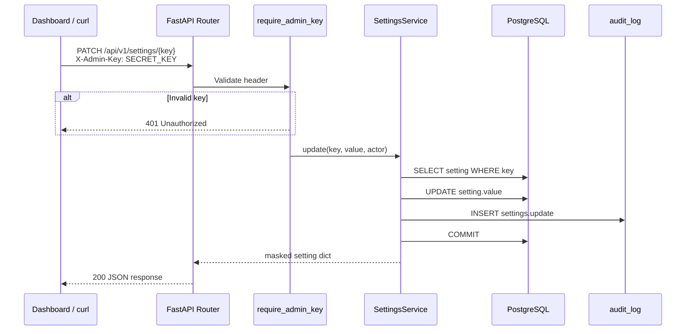

## Authentication Flow (Phase 1 — Current)

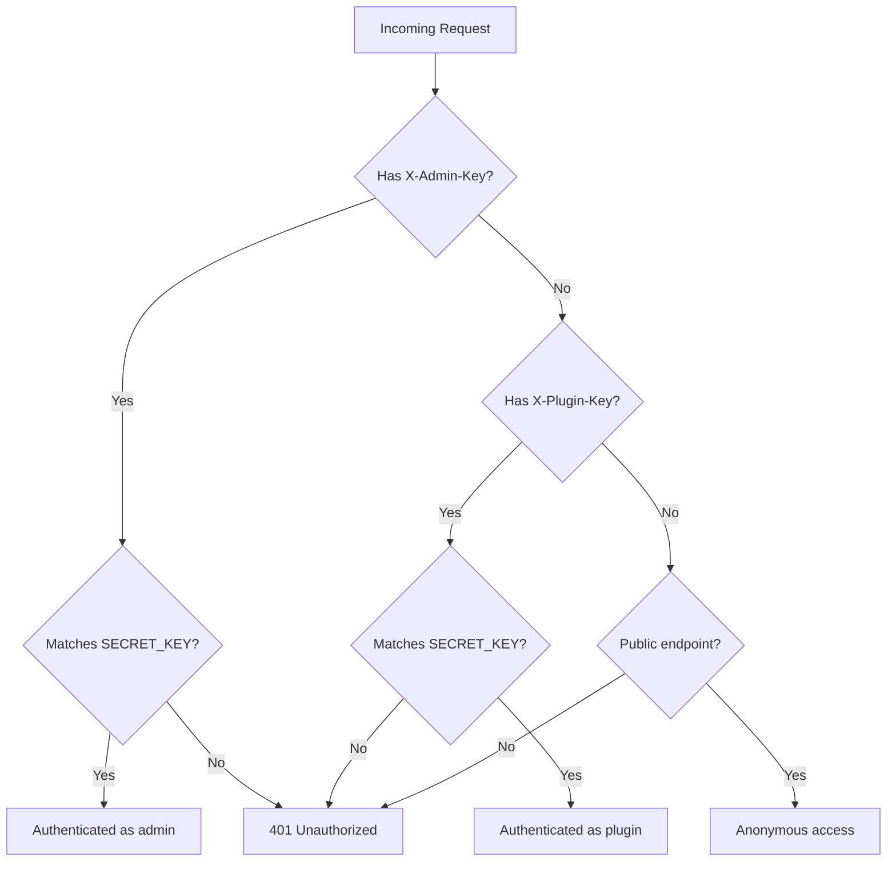

## Authentication Flow (Phase 3 — Planned)

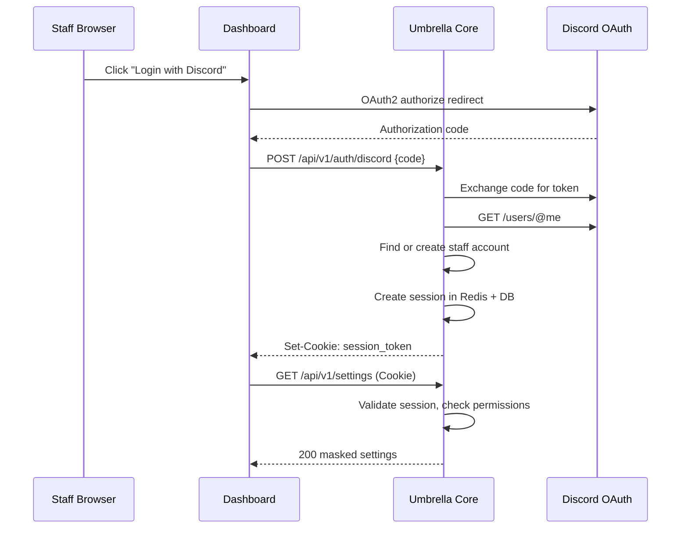

## Permission Flow (Phase 3+ — Planned)

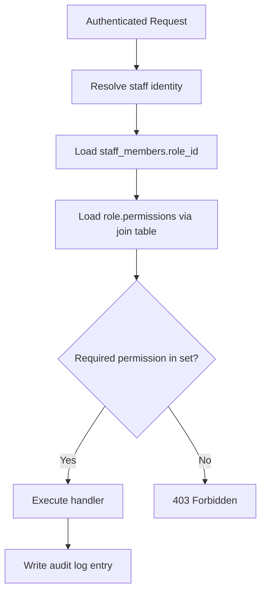

## Settings Flow

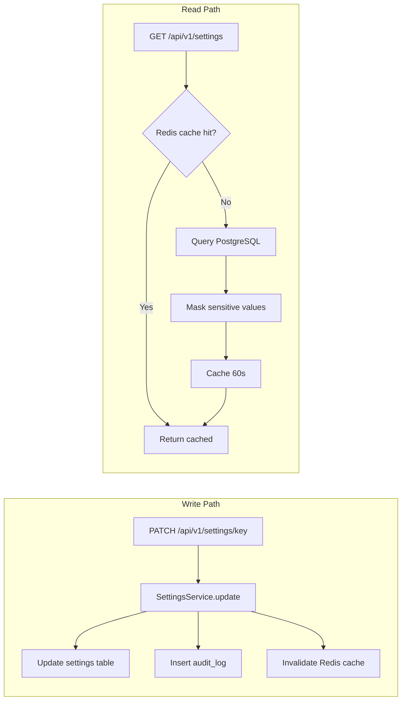

## Audit Flow

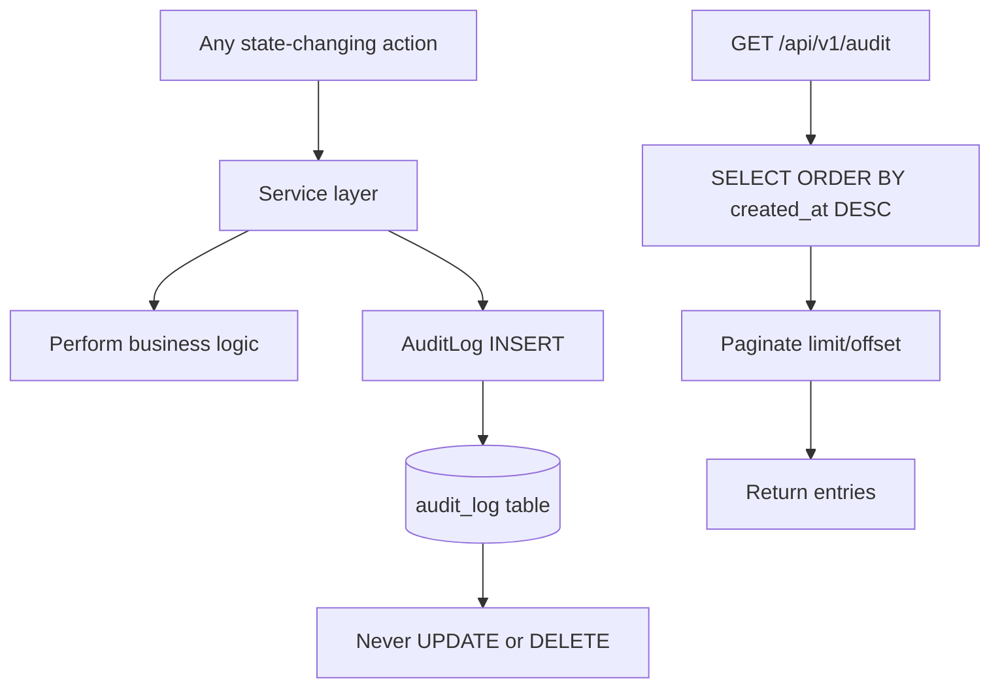

**Actor types:** `staff`, `plugin`, `bot`, `system`, `ai`

## Plugin Flow (Planned)

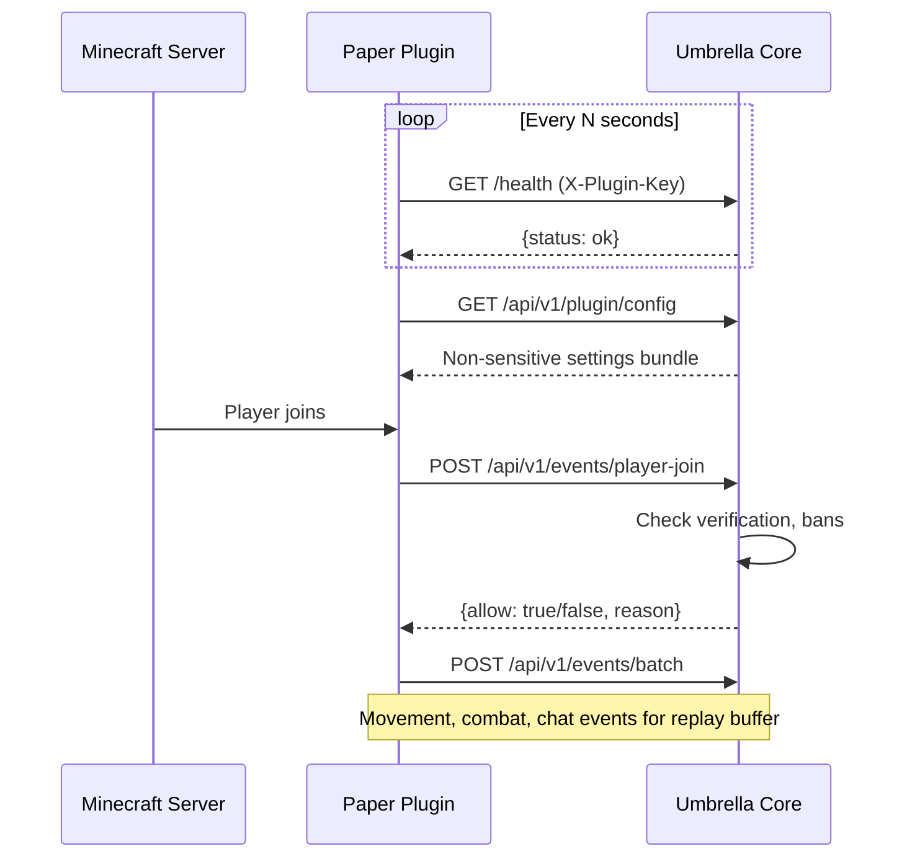

## Discord Flow (Planned)

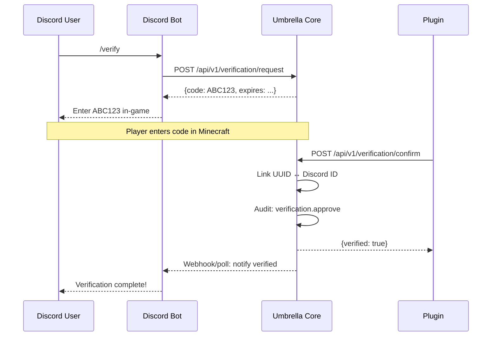

## Replay Flow (Planned)

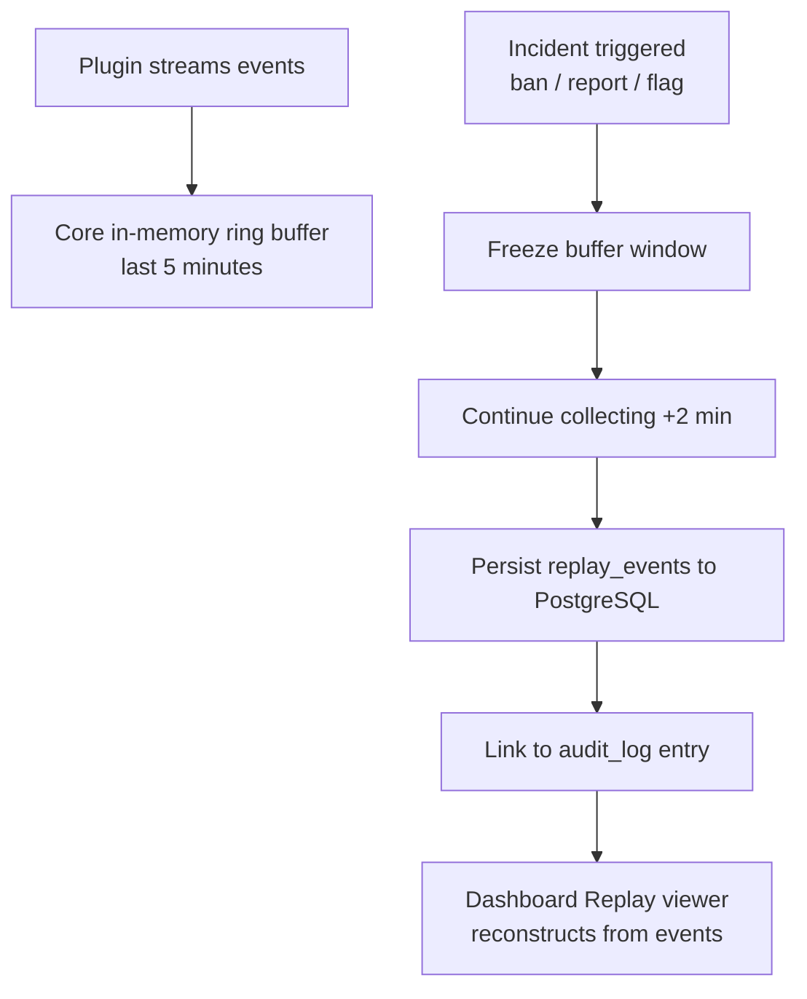

---

# 6. Database Specification

## Current Tables

### `settings`

| Column | Type | Constraints | Purpose |
|--------|------|-------------|---------|
| `id` | `VARCHAR(36)` | PK | UUID identifier |
| `key` | `VARCHAR(128)` | NOT NULL, UNIQUE, INDEX `ix_settings_key` | Dot-notation key (e.g. `discord.bot_token`) |
| `value` | `TEXT` | NOT NULL, DEFAULT `''` | String-encoded value |
| `category` | `VARCHAR(64)` | NOT NULL, DEFAULT `'general'` | UI grouping |
| `description` | `TEXT` | NOT NULL, DEFAULT `''` | Human-readable description |
| `sensitive` | `BOOLEAN` | NOT NULL, DEFAULT `false` | Mask in API when true |
| `requires_restart` | `BOOLEAN` | NOT NULL, DEFAULT `false` | Dashboard warning flag |
| `created_at` | `TIMESTAMPTZ` | NOT NULL, DEFAULT `now()` | Creation timestamp |
| `updated_at` | `TIMESTAMPTZ` | NOT NULL, DEFAULT `now()`, ON UPDATE | Last modification |

**Relationships:** None (standalone key-value store).

---

### `audit_log`

| Column | Type | Constraints | Purpose |
|--------|------|-------------|---------|
| `id` | `VARCHAR(36)` | PK | UUID identifier |
| `actor` | `VARCHAR(128)` | NOT NULL | Who performed the action (username, Discord ID, `plugin`, `system`) |
| `actor_type` | `VARCHAR(32)` | NOT NULL, DEFAULT `'system'` | `staff \| plugin \| bot \| system \| ai` |
| `action` | `VARCHAR(128)` | NOT NULL, INDEX `ix_audit_log_action` | Namespaced action string |
| `target` | `VARCHAR(128)` | NULLABLE | Affected entity identifier |
| `details_json` | `TEXT` | NOT NULL, DEFAULT `'{}'` | JSON context (stored as string) |
| `created_at` | `TIMESTAMPTZ` | NOT NULL, INDEX `ix_audit_log_created_at` | Immutable timestamp (no `updated_at`) |

**Relationships:** None. Append-only by design.

---

### `roles`

| Column | Type | Constraints | Purpose |
|--------|------|-------------|---------|
| `id` | `VARCHAR(36)` | PK | UUID identifier |
| `name` | `VARCHAR(64)` | NOT NULL, UNIQUE | Role slug (e.g. `owner`, `admin`) |
| `description` | `TEXT` | NOT NULL, DEFAULT `''` | Role description |
| `created_at` | `TIMESTAMPTZ` | NOT NULL | Creation timestamp |
| `updated_at` | `TIMESTAMPTZ` | NOT NULL, ON UPDATE | Last modification |

**Relationships:** Many-to-many with `permissions` via `role_permissions`.

---

### `permissions`

| Column | Type | Constraints | Purpose |
|--------|------|-------------|---------|
| `id` | `VARCHAR(36)` | PK | UUID identifier |
| `permission_key` | `VARCHAR(128)` | NOT NULL, UNIQUE, INDEX `ix_permissions_key` | Permission slug |
| `description` | `TEXT` | NOT NULL, DEFAULT `''` | Permission description |
| `created_at` | `TIMESTAMPTZ` | NOT NULL | Creation timestamp |

**Relationships:** Many-to-many with `roles` via `role_permissions`.

---

### `role_permissions` (join table)

| Column | Type | Constraints | Purpose |
|--------|------|-------------|---------|
| `role_id` | `VARCHAR(36)` | PK, FK → `roles.id` ON DELETE CASCADE | Role reference |
| `permission_id` | `VARCHAR(36)` | PK, FK → `permissions.id` ON DELETE CASCADE | Permission reference |

**Indexes:** Composite primary key only.

---

## Future Planned Tables

### `users` (staff accounts)

| Column | Type | Purpose |
|--------|------|---------|
| `id` | `VARCHAR(36)` PK | UUID |
| `discord_id` | `VARCHAR(32)` UNIQUE | Discord snowflake ID |
| `username` | `VARCHAR(128)` | Discord username |
| `role_id` | `VARCHAR(36)` FK → `roles.id` | Assigned role |
| `created_at` | `TIMESTAMPTZ` | Account creation |
| `last_login_at` | `TIMESTAMPTZ` | Last successful login |

### `sessions`

| Column | Type | Purpose |
|--------|------|---------|
| `id` | `VARCHAR(36)` PK | Session UUID |
| `user_id` | `VARCHAR(36)` FK → `users.id` | Staff account |
| `token_hash` | `VARCHAR(128)` | Hashed session token |
| `expires_at` | `TIMESTAMPTZ` | Expiration |
| `created_at` | `TIMESTAMPTZ` | Creation |
| `ip_address` | `VARCHAR(45)` | Client IP for audit |

### `verification_links`

| Column | Type | Purpose |
|--------|------|---------|
| `id` | `VARCHAR(36)` PK | UUID |
| `minecraft_uuid` | `VARCHAR(36)` | Player UUID |
| `discord_id` | `VARCHAR(32)` | Discord snowflake |
| `status` | `VARCHAR(16)` | `pending \| approved \| denied \| expired` |
| `code` | `VARCHAR(16)` | One-time verification code |
| `requested_at` | `TIMESTAMPTZ` | Request timestamp |
| `resolved_at` | `TIMESTAMPTZ` | Approval/denial timestamp |
| `resolved_by` | `VARCHAR(128)` | Staff actor or `system` |

### `player_stats`

| Column | Type | Purpose |
|--------|------|---------|
| `id` | `VARCHAR(36)` PK | UUID |
| `minecraft_uuid` | `VARCHAR(36)` INDEX | Player |
| `metric` | `VARCHAR(64)` | e.g. `joins`, `deaths`, `playtime_seconds` |
| `value` | `BIGINT` | Aggregated counter |
| `period` | `VARCHAR(16)` | `daily \| weekly \| alltime` |
| `period_start` | `DATE` | Aggregation window start |
| `updated_at` | `TIMESTAMPTZ` | Last aggregation |

### `player_snapshots`

| Column | Type | Purpose |
|--------|------|---------|
| `id` | `VARCHAR(36)` PK | UUID |
| `minecraft_uuid` | `VARCHAR(36)` INDEX | Player |
| `timestamp` | `TIMESTAMPTZ` INDEX | Snapshot time |
| `health` | `FLOAT` | Health points |
| `food` | `INTEGER` | Food level |
| `xp` | `FLOAT` | Experience |
| `inventory_json` | `TEXT` | Serialized inventory |
| `armor_json` | `TEXT` | Serialized armor |
| `offhand_json` | `TEXT` | Serialized offhand item |
| `location_x` | `DOUBLE` | X coordinate |
| `location_y` | `DOUBLE` | Y coordinate |
| `location_z` | `DOUBLE` | Z coordinate |
| `rotation_yaw` | `FLOAT` | Yaw |
| `rotation_pitch` | `FLOAT` | Pitch |
| `world` | `VARCHAR(128)` | World name |
| `dimension` | `VARCHAR(64)` | Dimension key |

### `replay_events`

| Column | Type | Purpose |
|--------|------|---------|
| `id` | `VARCHAR(36)` PK | UUID |
| `replay_id` | `VARCHAR(36)` INDEX | Parent replay session |
| `minecraft_uuid` | `VARCHAR(36)` INDEX | Player |
| `event_type` | `VARCHAR(64)` | `movement \| inventory \| combat \| command \| damage \| block` |
| `event_data_json` | `TEXT` | Event payload |
| `timestamp` | `TIMESTAMPTZ` INDEX | Event time (microsecond precision) |
| `world` | `VARCHAR(128)` | World context |

### `analytics_events`

| Column | Type | Purpose |
|--------|------|---------|
| `id` | `VARCHAR(36)` PK | UUID |
| `event_type` | `VARCHAR(64)` INDEX | Event category |
| `minecraft_uuid` | `VARCHAR(36)` NULLABLE | Player (if applicable) |
| `data_json` | `TEXT` | Event payload |
| `created_at` | `TIMESTAMPTZ` INDEX | Event timestamp |

### `ai_tasks`

| Column | Type | Purpose |
|--------|------|---------|
| `id` | `VARCHAR(36)` PK | UUID |
| `task_type` | `VARCHAR(64)` | `analyze \| recommend \| draft` |
| `status` | `VARCHAR(16)` | `pending \| approved \| denied \| executed \| failed` |
| `prompt_json` | `TEXT` | Input context |
| `result_json` | `TEXT` | AI output |
| `requested_by` | `VARCHAR(128)` | Staff or system actor |
| `approved_by` | `VARCHAR(128)` NULLABLE | Approving staff member |
| `created_at` | `TIMESTAMPTZ` | Task creation |
| `resolved_at` | `TIMESTAMPTZ` NULLABLE | Approval/denial time |

---

# 7. Settings Registry Specification

## Design

The settings registry is the **single configuration surface** for all UmbrellaOS clients. After first boot, runtime configuration lives in PostgreSQL, not in `.env` files or client-side configs.

### Categories

| Category | Purpose | Settings Count |
|----------|---------|----------------|
| `discord` | Discord bot and OAuth configuration | 5 |
| `rcon` | Minecraft RCON connection | 3 |
| `ai` | AI Operations Center | 2 |
| `server` | Server identity and capacity | 2 |
| `moderation` | Moderation policy flags | 2 |
| `sync` | Plugin synchronization intervals | 2 |

### Validation (Current vs Planned)

| Aspect | Current | Planned |
|--------|---------|---------|
| Type checking | None — all values stored as strings | JSON Schema per setting key |
| Range validation | None | Min/max for numeric settings |
| Format validation | None | Regex for IDs, URLs, tokens |
| Required fields | None enforced | Non-empty validation for critical keys before client start |

### Masking

- Settings with `sensitive=True` return `"***"` in all API responses
- Internal service method `get_value()` returns unmasked values for Core-internal use
- `manage_secrets` permission required to view unmasked values via API (Phase 3+)
- Audit log masks sensitive old/new values in `details_json`

### Encryption (Future)

| Phase | Strategy |
|-------|----------|
| Current | Plaintext in PostgreSQL; masked at API boundary |
| Phase 3+ | Application-level encryption for `sensitive=True` values using a key derived from `SECRET_KEY` + per-value salt |
| Phase 5+ | Envelope encryption with key rotation support |

Sensitive values (`discord.bot_token`, `discord.client_secret`, `rcon.password`, `ai.openrouter_key`) should be encrypted at rest before production deployment.

### Restart Warnings

Settings with `requires_restart=True` trigger a dashboard warning banner: *"Changing this setting requires restarting affected services."*

| Setting | Requires Restart | Affected Service |
|---------|------------------|------------------|
| `discord.bot_token` | Yes | Discord bot |
| `discord.client_id` | Yes | Discord bot + OAuth |
| `discord.client_secret` | Yes | Discord bot + OAuth |

### Auditing

Every settings change writes an audit entry:

```json
{
  "action": "settings.update",
  "actor": "dashboard",
  "actor_type": "staff",
  "target": "discord.bot_token",
  "details_json": {
    "key": "discord.bot_token",
    "old_value": "***",
    "new_value": "***"
  }
}
```

## All Default Settings

| Key | Default | Category | Sensitive | Restart | Description |
|-----|---------|----------|-----------|---------|-------------|
| `discord.bot_token` | `""` | discord | **Yes** | **Yes** | Discord bot token |
| `discord.client_id` | `""` | discord | No | **Yes** | Discord OAuth2 client ID |
| `discord.client_secret` | `""` | discord | **Yes** | **Yes** | Discord OAuth2 client secret |
| `discord.guild_id` | `""` | discord | No | No | Discord server (guild) ID |
| `discord.staff_channel` | `""` | discord | No | No | Staff alerts channel ID |
| `rcon.host` | `localhost` | rcon | No | No | Minecraft RCON host |
| `rcon.port` | `25575` | rcon | No | No | Minecraft RCON port |
| `rcon.password` | `""` | rcon | **Yes** | No | Minecraft RCON password |
| `ai.openrouter_key` | `""` | ai | **Yes** | No | OpenRouter API key |
| `ai.model` | `openai/gpt-4o-mini` | ai | No | No | AI model identifier |
| `server.name` | `UmbrellaMC` | server | No | No | Server display name |
| `server.max_players` | `50` | server | No | No | Max player slots |
| `moderation.require_discord_link` | `true` | moderation | No | No | Require Discord link to join |
| `moderation.ban_expiry_check_minutes` | `5` | moderation | No | No | Temp-ban expiry check interval |
| `sync.mutes_interval_seconds` | `30` | sync | No | No | Plugin mute sync interval |
| `sync.plugin_heartbeat_timeout` | `120` | sync | No | No | Seconds before plugin marked offline |

### Sensitive Settings Summary

These four settings are flagged `sensitive=True` and masked in all API responses:

1. `discord.bot_token` — Discord bot authentication token
2. `discord.client_secret` — OAuth2 client secret
3. `rcon.password` — Minecraft server RCON password
4. `ai.openrouter_key` — OpenRouter API key for AI Operations

### Bootstrap vs Runtime Config

| Source | Purpose | Examples |
|--------|---------|----------|
| `.env` / environment | Bootstrap only — DB connection, `SECRET_KEY`, `INITIAL_ADMIN_DISCORD_ID` | `DATABASE_URL`, `SECRET_KEY` |
| Database `settings` table | All runtime config consumed by clients | `discord.bot_token`, `rcon.host` |

Legacy `.env` fields (`DISCORD_BOT_TOKEN`, `RCON_PASSWORD`, etc.) exist for migration convenience but are **not** automatically copied to the database on boot. Future milestone: one-time migration script on first boot.

---

# 8. Audit System Specification

## Design Principles

| Principle | Implementation |
|-----------|----------------|
| **Append-only** | No `updated_at` column; no UPDATE/DELETE API or service methods |
| **Immutability** | Once written, audit records are permanent |
| **Complete context** | `details_json` stores arbitrary JSON; never truncate |
| **Actor taxonomy** | Five actor types: `staff`, `plugin`, `bot`, `system`, `ai` |
| **Namespaced actions** | Dot-notation: `settings.update`, `ban.create`, `verification.approve` |

## Retention Strategy

| Tier | Duration | Storage |
|------|----------|---------|
| Hot | 90 days | PostgreSQL primary table |
| Warm | 1 year | Partitioned archive table or compressed JSON export |
| Cold | Indefinite | Object storage (S3-compatible) with audit integrity hashes |

Retention enforcement via scheduled `system` actor job. Audit records are **never deleted** from cold storage; only moved.

## Search Strategy

| Filter | Implementation |
|--------|----------------|
| By `actor_type` | Indexed column; implemented in `GET /api/v1/audit?actor_type=staff` |
| By `action` | Indexed column; **planned** `GET /api/v1/audit?action=settings.update` |
| By `actor` | Full scan or future index on `actor` column |
| By `target` | Full scan or future index on `target` column |
| By date range | Indexed `created_at`; **planned** `?from=...&to=...` |
| Full-text in `details_json` | PostgreSQL `GIN` index on `details_json` (future) |

## Pagination Strategy

Current implementation:

```
GET /api/v1/audit?limit=50&offset=0&actor_type=staff
```

| Parameter | Default | Max | Notes |
|-----------|---------|-----|-------|
| `limit` | 50 | 200 | Page size |
| `offset` | 0 | — | Skip N records |
| `actor_type` | null | — | Optional filter |

**Known gap:** `total` in the response returns the count of entries in the current page, not the total matching records. Future fix: separate `SELECT COUNT(*)` query.

**Planned:** Cursor-based pagination using `created_at` + `id` for large datasets.

## All Required Audit Actions

### Settings

| Action | Trigger | Details |
|--------|---------|---------|
| `settings.create` | New setting key added | `{key, value, category}` |
| `settings.update` | Setting value changed | `{key, old_value, new_value}` — **implemented** |
| `settings.delete` | Setting removed | `{key, last_value}` |

### Roles & Permissions

| Action | Trigger | Details |
|--------|---------|---------|
| `role.create` | Custom role created | `{name, permissions[]}` |
| `role.update` | Role permissions modified | `{name, added[], removed[]}` |
| `role.delete` | Role removed | `{name}` |
| `permission.grant` | Permission added to role | `{role, permission}` |
| `permission.revoke` | Permission removed from role | `{role, permission}` |

### Staff

| Action | Trigger | Details |
|--------|---------|---------|
| `staff.create` | Staff account created | `{discord_id, role}` |
| `staff.update` | Role assignment changed | `{discord_id, old_role, new_role}` |
| `staff.login` | Successful login | `{discord_id, ip}` |
| `staff.logout` | Session terminated | `{discord_id}` |

### Moderation

| Action | Trigger | Details |
|--------|---------|---------|
| `kick` | Player kicked | `{uuid, username, reason, staff}` |
| `warn` | Player warned | `{uuid, username, reason, staff}` |
| `mute` | Player muted | `{uuid, username, duration, reason, staff}` |
| `unmute` | Player unmuted | `{uuid, username, staff}` |
| `ban` | Player banned | `{uuid, username, reason, staff, duration}` |
| `unban` | Player unbanned | `{uuid, username, staff}` |
| `tempban` | Temporary ban issued | `{uuid, username, reason, staff, expires_at}` |
| `ipban` | IP address banned | `{ip, reason, staff}` |

### Verification

| Action | Trigger | Details |
|--------|---------|---------|
| `verification.request` | Link requested | `{uuid, discord_id, code}` |
| `verification.approve` | Link approved | `{uuid, discord_id, method}` |
| `verification.deny` | Link denied | `{uuid, discord_id, reason}` |
| `verification.unlink` | Link removed | `{uuid, discord_id, staff}` |

### AI Operations

| Action | Trigger | Details |
|--------|---------|---------|
| `ai.analyze` | AI analysis requested | `{task_id, context}` |
| `ai.recommend` | AI recommendation generated | `{task_id, recommendation}` |
| `ai.draft` | AI draft created | `{task_id, draft_type}` |
| `ai.approve` | Staff approved AI action | `{task_id, approved_by}` |
| `ai.deny` | Staff denied AI action | `{task_id, denied_by, reason}` |
| `ai.execute` | Approved AI action executed | `{task_id, result}` |

### System

| Action | Trigger | Details |
|--------|---------|---------|
| `system.startup` | Core started | `{version}` |
| `system.plugin_online` | Plugin heartbeat received | `{plugin_version}` |
| `system.plugin_offline` | Plugin heartbeat timeout | `{last_seen}` |

---

# 9. Permission System Specification

## Design

UmbrellaOS replaces hardcoded Bukkit permission nodes (`umbrella.helper`, `umbrella.mod`, `umbrella.admin`) with a database-driven RBAC system where **Core is the authority**.

### Roles

| Role | Description | Permission Count |
|------|-------------|------------------|
| `owner` | Full access to everything | 14 (all) |
| `admin` | Full except role management, API keys, and secrets | 11 |
| `moderator` | Moderation actions | 8 |
| `helper` | Basic helper actions | 3 |

### Inheritance Model

**Current:** Flat role → permissions mapping. No role hierarchy.

**Planned:** Custom roles with explicit permission sets. Optional role inheritance (e.g. `senior_mod` inherits `moderator` permissions + extras). Inheritance resolved at permission check time by unioning all permissions from the role chain.

### Future Custom Roles

- Dashboard UI to create/edit roles (requires `manage_roles`)
- Custom roles stored in `roles` table with user-defined permission sets
- Staff members assigned to exactly one role via `users.role_id`
- Owner role cannot be deleted or have permissions reduced

## All Current Permissions

| Permission Key | Description | owner | admin | moderator | helper |
|----------------|-------------|:-----:|:-----:|:---------:|:------:|
| `kick_players` | Kick players from the server | ✓ | ✓ | ✓ | ✓ |
| `warn_players` | Warn players | ✓ | ✓ | ✓ | ✓ |
| `lookup_players` | View player history and records | ✓ | ✓ | ✓ | ✓ |
| `mute_players` | Mute/unmute players | ✓ | ✓ | ✓ | |
| `ban_players` | Ban/unban players | ✓ | ✓ | ✓ | |
| `tempban_players` | Temporarily ban players | ✓ | ✓ | ✓ | |
| `manage_appeals` | Review and action ban appeals | ✓ | ✓ | ✓ | |
| `manage_announcements` | Send server-wide announcements | ✓ | ✓ | ✓ | |
| `ipban` | IP-ban addresses | ✓ | ✓ | | |
| `view_audit_log` | View the audit log | ✓ | ✓ | | |
| `manage_settings` | Edit Core settings from dashboard | ✓ | ✓ | | |
| `manage_roles` | Create and edit staff roles | ✓ | | | |
| `manage_api_keys` | Issue and revoke API keys | ✓ | | | |
| `manage_secrets` | View unmasked sensitive settings | ✓ | | | |

**Note:** `ipban` is seeded as a permission but only assigned to `owner` (via "all permissions" seed logic). Admin does not have `ipban` by default.

**Enforcement status:** Permissions exist in the database but are **not checked** on any API route in Phase 1. Phase 3 will add `require_permission("manage_settings")` dependencies.

---

# 10. Authentication Roadmap

**Status:** Not implemented. Phase 3 milestone.

## Intended Architecture

### Discord OAuth2 Login

1. Dashboard redirects to `https://discord.com/api/oauth2/authorize` with `client_id`, `redirect_uri`, `scope=identify`
2. Discord redirects back with authorization `code`
3. Core exchanges code for access token using `discord.client_secret` from settings registry
4. Core fetches user profile (`/users/@me`) to get `discord_id` and `username`
5. Core finds or creates `users` record
6. Core creates `sessions` record with hashed token
7. Dashboard receives `Set-Cookie: umbrella_session=<token>` (HttpOnly, Secure, SameSite=Strict)

### Sessions

- Session tokens stored as SHA-256 hashes in `sessions` table
- Session metadata cached in Redis for fast validation (TTL = session expiry)
- Session lifetime: 24 hours default, configurable via settings
- Sliding expiration on activity

### Staff Accounts

- `users` table links `discord_id` → `role_id`
- First boot: `INITIAL_ADMIN_DISCORD_ID` from `.env` auto-assigned `owner` role
- Additional staff added by owners via dashboard (requires `manage_roles`)

### Owner Bootstrap

```
On first startup after users table exists:
  IF no users exist AND initial_admin_discord_id is set:
    CREATE user(discord_id=INITIAL_ADMIN_DISCORD_ID, role=owner)
    AUDIT staff.create
```

### Logout

- `POST /api/v1/auth/logout` deletes session from DB and Redis
- Audit: `staff.logout`

### Token Rotation

- On each request, if session is >50% expired, issue new token
- Old token invalidated immediately
- Prevents session fixation attacks

### API Key Tiers (Post-Phase 3)

| Key Type | Header | Scope |
|----------|--------|-------|
| Session token | `Cookie` or `Authorization: Bearer` | Staff dashboard, permission-scoped |
| Plugin key | `X-Plugin-Key` | Plugin endpoints only, per-plugin keys |
| Bot key | `X-Bot-Key` | Bot endpoints only |
| Admin bootstrap | `X-Admin-Key` | Deprecated after Phase 3; emergency access only |

---

# 11. Dashboard Roadmap

**Status:** Not implemented. Phase 4 milestone.

## Planned Pages

### Overview

| Aspect | Detail |
|--------|--------|
| **Purpose** | At-a-glance server health, online players, recent audit activity, plugin status |
| **Data sources** | `GET /health`, `GET /api/v1/audit?limit=10`, future player count endpoint, plugin heartbeat status |
| **Permissions** | Any authenticated staff member |

### Settings

| Aspect | Detail |
|--------|--------|
| **Purpose** | Browse and edit all settings grouped by category; show restart warnings |
| **Data sources** | `GET /api/v1/settings`, `PATCH /api/v1/settings/{key}` |
| **Permissions** | `manage_settings` to edit; any staff to view (masked) |

### Audit

| Aspect | Detail |
|--------|--------|
| **Purpose** | Searchable, filterable audit log with detail expansion |
| **Data sources** | `GET /api/v1/audit` with filters |
| **Permissions** | `view_audit_log` |

### Players

| Aspect | Detail |
|--------|--------|
| **Purpose** | Player lookup, history, linked Discord account, stats summary |
| **Data sources** | Future `GET /api/v1/players`, `player_stats`, `verification_links` |
| **Permissions** | `lookup_players` |

### Punishments

| Aspect | Detail |
|--------|--------|
| **Purpose** | Issue and manage kicks, warns, mutes, bans, temp-bans, IP bans |
| **Data sources** | Future `POST /api/v1/punishments`, punishment tables |
| **Permissions** | Respective moderation permissions |

### Verification

| Aspect | Detail |
|--------|--------|
| **Purpose** | View pending verifications, approve/deny links, unlink accounts |
| **Data sources** | Future `GET /api/v1/verification`, `verification_links` table |
| **Permissions** | `lookup_players` to view; `manage_appeals` or dedicated permission to action |

### AI Tasks

| Aspect | Detail |
|--------|--------|
| **Purpose** | View AI recommendations, approve/deny drafts, execution history |
| **Data sources** | Future `GET /api/v1/ai/tasks`, `ai_tasks` table |
| **Permissions** | `manage_settings` or dedicated `manage_ai` permission |

### Analytics

| Aspect | Detail |
|--------|--------|
| **Purpose** | Charts and tables for player metrics, economy, chat volume |
| **Data sources** | `player_stats`, `analytics_events` aggregated endpoints |
| **Permissions** | `lookup_players` or dedicated `view_analytics` |

### Replay

| Aspect | Detail |
|--------|--------|
| **Purpose** | Browse incident replays, step through events, link to punishments |
| **Data sources** | `replay_events` table, future replay viewer API |
| **Permissions** | `lookup_players` + `view_audit_log` |

---

# 12. Verification System Specification

**Status:** Not implemented. Phase 7 milestone.

## Architecture

Verification links Minecraft player UUIDs to Discord accounts. All state lives in Core; bot and plugin are messengers.

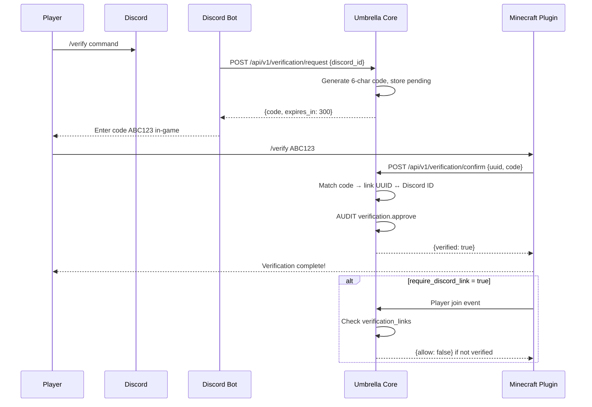

## Minecraft ↔ Discord Linking

| Field | Source |
|-------|--------|
| `minecraft_uuid` | Plugin reports on join / verify command |
| `discord_id` | Bot reports on `/verify` command |
| `code` | Core generates, single-use, 5-minute expiry |

## Approval Flow

| Method | Description |
|--------|-------------|
| **Automatic** | Code match within expiry window → auto-approve |
| **Manual** | Staff approves via dashboard (for edge cases, name disputes) |
| **Denial** | Staff denies with reason; audit `verification.deny` |

## Audit Requirements

Every verification state change must produce an audit entry: `verification.request`, `verification.approve`, `verification.deny`, `verification.unlink`.

---

# 13. Minecraft Plugin Specification

**Status:** Not implemented. Phase 8 milestone.

## Paper Plugin Overview

A Java Paper plugin that acts as a **thin client** to Umbrella Core. All business logic (ban checks, mute lists, verification status) is queried from Core.

## Data Synchronization

| Data | Direction | Interval |
|------|-----------|----------|
| Mute list | Core → Plugin | `sync.mutes_interval_seconds` (default 30s) |
| Ban list | Core → Plugin | On join + periodic poll |
| Settings bundle | Core → Plugin | On connect + on change notification |
| Player events | Plugin → Core | Real-time batch |

## Heartbeat System

```
Every 30 seconds:
  Plugin → GET /health (X-Plugin-Key)
  Core records last_seen timestamp

If (now - last_seen) > sync.plugin_heartbeat_timeout (120s):
  Core marks plugin offline
  AUDIT system.plugin_offline
  Dashboard shows degraded status
```

## Command Execution

Core can queue commands for plugin execution:

```
Core → GET /api/v1/plugin/commands (plugin polls)
Plugin executes on main thread
Plugin → POST /api/v1/plugin/commands/{id}/complete
```

Commands: kick, ban, mute, announce, teleport (future).

## Punishment Synchronization

1. Staff issues ban via dashboard → Core writes punishment + audit
2. Plugin polls or receives push → applies ban in-game
3. Plugin reports player join → Core checks ban list → deny entry if banned

## Analytics Collection

Plugin reports events to Core:

- `player.join`, `player.quit`
- `player.death`, `player.kill`
- `player.chat` (volume only, not content by default)
- `block.break`, `block.place` (aggregated)

---

# 14. Analytics Specification

**Status:** Not implemented. Phase 9 milestone.

## Collection

Events ingested via `POST /api/v1/analytics/events` from plugin and bot.

### Player Metrics

| Metric | Source | Aggregation |
|--------|--------|-------------|
| `joins` | Plugin: player join event | Counter per player per day |
| `leaves` | Plugin: player quit event | Counter per player per day |
| `deaths` | Plugin: death event | Counter per player per day |
| `kills` | Plugin: kill event | Counter per player per day |
| `playtime` | Plugin: join/quit delta | Sum of seconds per player per day |
| `chat_volume` | Plugin: chat event count | Counter per player per day (not content) |

### Economy Metrics (Future)

| Metric | Source |
|--------|--------|
| `balance` | Plugin: economy plugin integration |
| `transactions` | Plugin: transaction events |
| `shop_purchases` | Plugin: shop interaction events |

## Aggregation Strategy

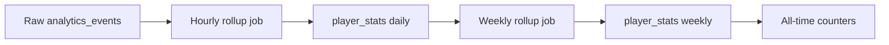

1. **Real-time:** Events written to `analytics_events` table
2. **Hourly:** Background job aggregates into `player_stats` with `period=daily`
3. **Daily:** Rollup job computes `period=weekly`
4. **On-demand:** All-time counters maintained via incremental updates

Retention: raw events 30 days; daily aggregates 1 year; weekly/alltime indefinite.

---

# 15. Replay System Specification

**Status:** Not implemented. Phase 10 milestone.

## Core Concept

Replay stores **EVENTS, not video**. The system captures structured game events in a ring buffer and persists a window around incidents for later reconstruction in the dashboard.

## Event Types

| Type | Data Captured |
|------|---------------|
| `movement` | UUID, x, y, z, yaw, pitch, world, timestamp |
| `inventory` | UUID, slot, item_id, count, nbt_hash, action (add/remove/move) |
| `combat` | Attacker UUID, victim UUID, weapon, damage, timestamp |
| `command` | UUID, command string, timestamp |
| `damage` | UUID, source, amount, cause, timestamp |
| `block` | UUID, action (break/place/interact), block_type, x, y, z, timestamp |

## Replay Window

| Segment | Duration | Description |
|---------|----------|-------------|
| **Pre-incident buffer** | 5 minutes | Rolling in-memory ring buffer continuously fed by plugin |
| **Post-incident capture** | 2 minutes | Continues collecting after incident trigger |
| **Total replay** | 7 minutes | Persisted as a single `replay_id` group in `replay_events` |

### Incident Triggers

- Staff ban or mute action
- Anti-cheat flag
- Player report
- Manual replay capture from dashboard

## Storage Architecture

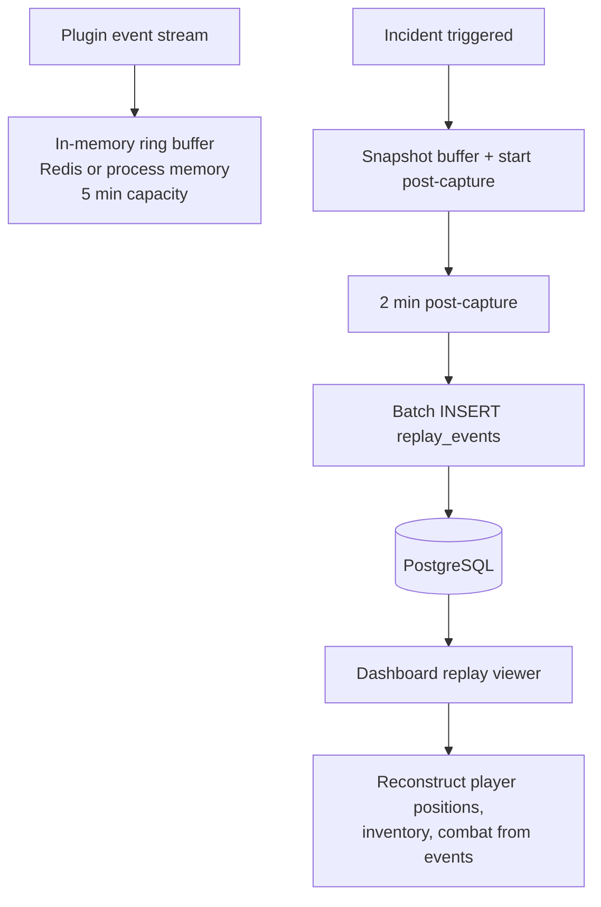

**Storage estimate:** ~50 events/second/player × 7 minutes × 50 players ≈ 1M events/incident. Batch compressed JSON storage. Partition by `replay_id`.

---

# 16. Player Snapshot System

**Status:** Not implemented. Phase 11 milestone.

## Purpose

Periodic point-in-time captures of player state for moderation context and replay correlation.

## Snapshot Fields

| Field | Type | Description |
|-------|------|-------------|
| `minecraft_uuid` | UUID | Player identifier |
| `timestamp` | TIMESTAMPTZ | Capture time |
| `health` | FLOAT | Current health |
| `food` | INTEGER | Food level |
| `xp` | FLOAT | Experience points |
| `inventory` | JSON | Full inventory contents |
| `armor` | JSON | Armor slots |
| `offhand` | JSON | Offhand item |
| `location` | x, y, z | Position |
| `rotation` | yaw, pitch | View direction |
| `world` | STRING | World name |
| `dimension` | STRING | Dimension key (overworld, nether, end) |

## Capture Schedule

- Every 5 minutes per online player (configurable)
- On incident trigger (ban, report, flag) — immediate snapshot
- On player quit — final snapshot

## Relationship to Replay System

| System | Granularity | Purpose |
|--------|-------------|---------|
| **Snapshots** | Periodic (every 5 min) | "What did the player have at time T?" |
| **Replay** | Continuous events (sub-second) | "What happened leading up to the incident?" |

Snapshots provide quick inventory/location context; replay provides the full timeline. Dashboard links snapshots to replay windows by timestamp proximity.

---

# 17. AI Operations Center

**Status:** Not implemented. Phase 12 milestone.

## Architecture

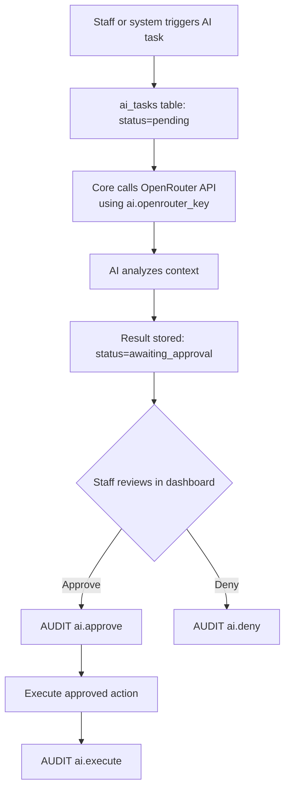

## AI May

| Capability | Example |
|------------|---------|
| **Analyze** | Review chat logs for toxicity patterns |
| **Recommend** | Suggest ban duration based on offense history |
| **Draft** | Draft announcement text, appeal response, report summary |

## AI May NOT

| Prohibited Action | Reason |
|-------------------|--------|
| Merge code automatically | Code changes require human review |
| Push code automatically | Deployment is a human decision |
| Change permissions automatically | Security-sensitive; requires staff approval |
| Delete data automatically | Destructive; requires explicit approval |
| Execute moderation actions without approval | All punishments require staff sign-off |
| View unmasked secrets | AI tasks receive redacted context only |

## Approval Workflow

1. Task created with `status=pending`
2. AI processes → `status=awaiting_approval` with `result_json`
3. Staff with appropriate permission reviews in dashboard
4. Approve → `status=approved` → execute → `status=executed`
5. Deny → `status=denied` with reason
6. Every state transition audited

## Configuration

| Setting | Purpose |
|---------|---------|
| `ai.openrouter_key` | API authentication (sensitive) |
| `ai.model` | Model selection (default: `openai/gpt-4o-mini`) |

---

# 18. Security Requirements

| Requirement | Current State | Target State |
|-------------|---------------|--------------|
| **Passwords hashed** | N/A (no passwords yet) | bcrypt for any future local accounts; OAuth primary |
| **Secrets encrypted** | Plaintext in DB | Application-level encryption for `sensitive=True` settings |
| **API keys encrypted** | Shared `SECRET_KEY` in `.env` | Per-client API keys, hashed in DB, rotatable |
| **Settings masked** | Implemented (`***`) | Maintain; add `manage_secrets` gate for unmask |
| **Audit immutable** | Implemented (no update/delete) | Maintain; add integrity hashes for tamper detection |
| **Principle of least privilege** | Permissions defined, not enforced | Enforce on every route via dependency injection |
| **Session security** | Not implemented | HttpOnly, Secure, SameSite=Strict cookies; hashed tokens |
| **CORS restriction** | Placeholder domain in production | Configure actual dashboard domain |
| **Input validation** | Pydantic on PATCH body | JSON Schema on all settings; sanitize all inputs |
| **Rate limiting** | Not implemented | Per-IP and per-session rate limits on auth endpoints |
| **SQL injection** | Protected via SQLAlchemy ORM | Maintain ORM-only queries; no raw SQL with user input |

---

# 19. Development Workflow

Every development session must follow this process:

```
1. Analyze repository
   └─ Read this blueprint + scan files/umbrella-core/

2. Determine current phase
   └─ Check Section 3 milestone status tables

3. Produce completion report
   └─ Document what exists vs what is missing for the target milestone

4. Implement smallest milestone
   └─ One feature, one PR-worth of changes

5. Verify changes
   └─ Manual testing via curl/httpx; run existing tests when available

6. Commit
   └─ Only when explicitly requested; follow repo commit message style

7. Update blueprint
   └─ Update Section 3 status, Section 6 tables, API tables, and progress %
```

### Milestone Sizing Guidelines

| Good Milestone | Bad Milestone |
|----------------|---------------|
| Add `settings.create` audit action | Build entire dashboard |
| Wire `require_plugin_key` to `/api/v1/plugin/config` | Implement full moderation system |
| Add pytest health check test | Refactor entire service layer |
| Fix audit `total` count query | Add all future database tables at once |

---

# 20. Definition of Done

Every milestone is complete only when **all** criteria are met:

| Criterion | Description |
|-----------|-------------|
| **Implementation** | Code written, follows existing conventions, minimal scope |
| **Verification** | Manually tested or covered by automated test |
| **Audit coverage** | State-changing operations write audit log entries |
| **Documentation updates** | This blueprint updated (Section 3 status, relevant specs) |
| **Git commit** | Committed when user requests; descriptive message |
| **Completion report** | Written summary of what was done, what remains |

---

# Appendix A: Roadmap Progress

## Progress Calculation

| Phase | Weight | Completion | Weighted |
|-------|--------|------------|----------|
| 1 — Core Foundation | 15% | 85% | 12.75% |
| 2 — Client Config | 8% | 0% | 0% |
| 3 — Authentication | 10% | 0% | 0% |
| 4 — Dashboard | 12% | 0% | 0% |
| 5 — Audit Enhancement | 5% | 10% | 0.5% |
| 6 — Moderation | 10% | 0% | 0% |
| 7 — Verification | 8% | 0% | 0% |
| 8 — Minecraft Plugin | 10% | 0% | 0% |
| 9 — Analytics | 7% | 0% | 0% |
| 10 — Replay | 7% | 0% | 0% |
| 11 — Snapshots | 3% | 0% | 0% |
| 12 — AI Operations | 5% | 0% | 0% |
| **Total** | **100%** | | **~13%** |

## Recommended Next Milestone

**Phase 1 Cleanup: Add test suite + fix audit pagination**

| Task | Rationale |
|------|-----------|
| Add `tests/` with pytest + httpx async client | No tests exist; foundation for all future work |
| Test health, settings CRUD, auth rejection | Covers core API surface |
| Fix `total` in audit endpoint to return full count | Known bug documented in blueprint |
| Add `.gitignore` | Missing from repository |

### Affected Files

| File | Change |
|------|--------|
| `tests/conftest.py` | New — test fixtures, async client |
| `tests/test_health.py` | New — health endpoint tests |
| `tests/test_settings.py` | New — settings CRUD + auth tests |
| `tests/test_audit.py` | New — audit pagination tests |
| `files/umbrella-core/api/routers/audit.py` | Fix `total` count |
| `.gitignore` | New — Python, .env, __pycache__ |
| `docs/UMBRELLA_BLUEPRINT.md` | Update Phase 1 status after completion |

**Alternative next milestone:** Phase 2 start — add `GET /api/v1/plugin/config` endpoint with `require_plugin_key` returning non-sensitive settings bundle for plugin consumption.

---

# Appendix B: Technical Debt Report

| ID | Severity | Description | Location |
|----|----------|-------------|----------|
| TD-01 | **High** | No test suite | Repository root |
| TD-02 | **High** | Permissions not enforced on API routes | All `/api/v1/*` routers |
| TD-03 | **High** | No `.gitignore` | Repository root |
| TD-04 | **Medium** | Duplicate `files/main.py` and `files/README.md` | `files/` |
| TD-05 | **Medium** | Audit `total` returns page count, not table count | `api/routers/audit.py:39` |
| TD-06 | **Medium** | `GET /api/v1/audit/{action}` documented but not implemented | `api/routers/audit.py` docstring |
| TD-07 | **Medium** | `require_plugin_key` defined but unused | `api/middleware/auth.py` |
| TD-08 | **Medium** | `INITIAL_ADMIN_DISCORD_ID` configured but unused | `config/settings.py` |
| TD-09 | **Medium** | Settings actor hardcoded as `"dashboard"` | `api/routers/settings.py:62` |
| TD-10 | **Low** | Redis installed and configured but no caching code | `settings_service.py` docstring vs implementation |
| TD-11 | **Low** | `.env` legacy fields not migrated to DB on boot | `config/settings.py` |
| TD-12 | **Low** | Unused imports in `roles_service.py` | `json`, `AuditLog` imported but unused |
| TD-13 | **Low** | `create_tables()` on every startup (dev pattern in prod path) | `main.py:40` |
| TD-14 | **Low** | No `pyproject.toml` (requirements.txt only) | Repository root |
| TD-15 | **Info** | README says admin lacks `manage_roles` + `manage_api_keys`; code also excludes `manage_secrets` | `roles_service.py:37` vs `README.md` |
| TD-16 | **Info** | CORS production domain is placeholder | `main.py:71` |

---

# Appendix C: Environment Variables Reference

| Variable | Required | Default | Purpose |
|----------|----------|---------|---------|
| `DATABASE_URL` | Yes | `postgresql+asyncpg://...` | Async application database |
| `DATABASE_URL_SYNC` | No | `postgresql+psycopg2://...` | Sync driver (Alembic fallback) |
| `REDIS_URL` | No | `redis://localhost:6379/0` | Redis connection (future) |
| `SECRET_KEY` | Yes | `change-me-in-production` | Admin + plugin API key (Phase 1) |
| `INITIAL_ADMIN_DISCORD_ID` | No | `""` | Bootstrap owner (Phase 3) |
| `APP_HOST` | No | `0.0.0.0` | Server bind address |
| `APP_PORT` | No | `8765` | Server port |
| `DEBUG` | No | `false` | Debug mode, docs, CORS, SQL echo |
| `DISCORD_CLIENT_ID` | No | `""` | Legacy; migrate to DB settings |
| `DISCORD_CLIENT_SECRET` | No | `""` | Legacy; migrate to DB settings |
| `DISCORD_BOT_TOKEN` | No | `""` | Legacy; migrate to DB settings |
| `RCON_HOST` | No | `localhost` | Legacy; migrate to DB settings |
| `RCON_PORT` | No | `25575` | Legacy; migrate to DB settings |
| `RCON_PASSWORD` | No | `""` | Legacy; migrate to DB settings |
| `OPENROUTER_API_KEY` | No | `""` | Legacy; migrate to DB settings |

---

# Appendix D: Quick Reference for AI Sessions

When resuming development on UmbrellaOS:

1. **Read this file first** — it is authoritative
2. **Application root:** `files/umbrella-core/`
3. **Run locally:** `docker compose up -d` or `python main.py` after `alembic upgrade head`
4. **Admin auth:** `X-Admin-Key: <SECRET_KEY from .env>`
5. **Current phase:** 1 (Core Foundation, ~85% complete)
6. **Overall progress:** ~13%
7. **Next milestone:** Test suite + audit pagination fix (or plugin config endpoint)
8. **Never:** Modify bot/plugin/dashboard code that doesn't exist yet; implement in Core first
9. **Always:** Write audit entries for state changes; mask sensitive values; follow layered architecture

---

*End of UmbrellaOS Blueprint v1.0.0*
